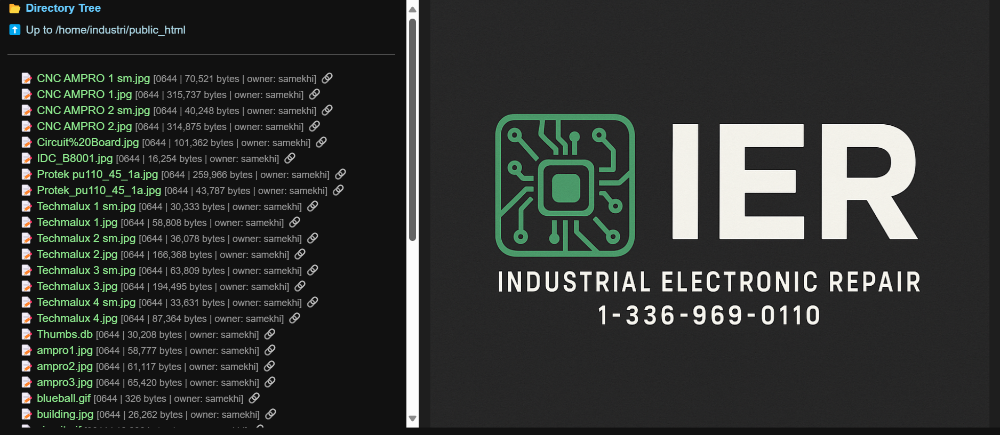

# PHP MC — CodeWalker Browser & Admin Tools

PHP MC bundles a set of dark-themed maintenance utilities for PHP 7.4+ hosts: a tree-based file browser, a lightweight CodeWalker Admin panel, configuration editors, an AI chat/API console, personal notes, and a .htaccess helper. Everything ships as flat PHP pages with zero external dependencies beyond SQLite and curl so it can run on shared hosting or a locked-down VM.【F:src/index.php†L4-L104】【F:src/codewalker.php†L1-L210】

---

## Core Components

### MC Browser (`src/index.php`)

* Browse any directory with a collapsible tree, inline metadata (permissions, owner, size), and syntax-highlighted previews for source files.【F:src/index.php†L33-L115】
* View images and PDFs inline, or launch the requested path in a new tab using the generated web URL.【F:src/index.php†L115-L147】
* Open a contextual “Tools” menu for each file to run `custom.php`, jump straight to the CodeWalker Admin record, or enqueue the path for CodeWalker processing.【F:src/index.php†L76-L111】
* Debug view exposes the current environment payload (`$mc_array`) when no file is selected to make troubleshooting easier.【F:src/index.php†L148-L160】

### CodeWalker Admin (`src/codewalker.php`)

* Connects to the `codewalker.db` SQLite database defined in `private/codewalker.json`, with optional password protection via `CODEWALKER_ADMIN_PASS`.【F:src/codewalker.php†L1-L116】【F:src/codewalker.php†L272-L317】
* Provides dashboard cards, recent action/rewrite tables, per-action detail views, and filtering tools for the `actions`, `files`, `rewrites`, and `queued_files` tables CodeWalker generates.【F:src/codewalker.php†L318-L497】
* Apply AI rewrites safely: each apply request backs up the target file, enforces CSRF tokens, verifies file hashes, and logs results to `applied_rewrites`.【F:src/codewalker.php†L118-L214】
* Manage the execution queue directly (add, mark done, or delete) so the mc-local walker can prioritize hot files or run in queue-only mode.【F:src/codewalker.php†L214-L266】
* Quick links jump back to the MC Browser or configuration editors using a shared navigation bar powered by `mc_menu.json`.【F:src/codewalker.php†L297-L317】【F:src/utils.php†L74-L119】

### Configuration & Navigation Helpers

* `config.php` offers a JSON editor for `private/codewalker.json` with live validation, pretty-print formatting, and timestamped backups before every save.【F:src/config.php†L1-L98】
* `codew_config.php` is a landing card that surfaces common directory roots and link-outs into the suite for faster hopping between tools.【F:src/codew_config.php†L1-L63】
* Update `src/mc_menu.json` to add or reorder shortcuts in the shared toolbar across pages.【F:src/mc_menu.json†L1-L8】【F:src/utils.php†L74-L119】

### AI Chat & API Console (`src/ai_chat.php`)

* Exercise OpenAI-compatible or Ollama/LM Studio endpoints with a curl-backed tester that supports JSON/form/raw payloads, custom headers, and request timeouts.【F:src/ai_chat.php†L1-L208】【F:src/ai_chat.php†L600-L653】
* Prefill models, base URLs, and auth headers from `.env` keys (`LLM_*`, `OPENAI_*`, `OLLAMA_*`) or from the CodeWalker config, then build boilerplate chat JSON bodies on the fly.【F:src/ai_chat.php†L99-L206】【F:src/ai_chat.php†L430-L520】
* Persist every test run—including response bodies, status codes, and curl diagnostics—into `private/db/chat.db` for later inspection, and reload or diff past attempts from the sidebar.【F:src/ai_chat.php†L360-L444】

### Personal Notes (`src/notes.php`)

* Capture Markdown-formatted snippets with tagging, search, and live previews; entries are stored in `private/db/notes.db` with CSRF protection and deletion workflows.【F:src/notes.php†L1-L154】【F:src/notes.php†L224-L311】

### .htaccess Helper (`src/php-htaccess/index.php`)

* Generate `.htaccess` and `.htpasswd` files, optionally calling out to `htpasswd` for bcrypt hashes or falling back to PHP implementations (including APR1).【F:src/php-htaccess/index.php†L1-L120】
* Store credentials under `src/private/passwords`, test changes safely in a sandbox directory, and apply CSRF checks before writing to disk.【F:src/php-htaccess/index.php†L40-L105】

---

## Getting Started

1. **Copy the suite** into a protected admin area (e.g., `/admin/php_mc/src/`). All pages assume the `src/` directory as their root.
2. **Ensure prerequisites**: PHP 7.4+ with `pdo_sqlite`, `curl`, and permission to create files under `src/private/` for configs, backups, and SQLite databases.【F:src/codewalker.php†L83-L116】【F:src/ai_chat.php†L360-L444】
3. **Configure CodeWalker** using `config.php`, then point the mc-local walker or cron job at the generated `codewalker.json` file.【F:src/config.php†L1-L98】
4. **Secure access** with HTTP auth (use the `.htaccess` helper) or an upstream proxy; the tools are meant for internal maintenance and expose powerful file operations.【F:src/php-htaccess/index.php†L1-L120】【F:src/codewalker.php†L1-L116】

To launch, visit the entry card at `codew_config.php` or any module directly (`codewalker.php`, `index.php`, `ai_chat.php`, `notes.php`).【F:src/codew_config.php†L1-L63】

---

## Data & Storage

* **Configurations** live under `src/private/` (`codewalker.json`, backups, menu definitions).【F:src/config.php†L1-L98】
* **SQLite databases**: `codewalker.db` (walker telemetry), `notes.db` (personal notes), `chat.db` (API console logs).【F:src/codewalker.php†L1-L210】【F:src/notes.php†L1-L154】【F:src/ai_chat.php†L360-L444】
* **Backups**: Any rewrite apply or config save writes timestamped `.bak.YYYYMMDD_HHMMSS` files alongside the originals for quick rollback.【F:src/codewalker.php†L118-L214】【F:src/config.php†L37-L63】

---

## Security Guidance

* Do **not** expose these tools publicly; they assume you are already on a trusted network or behind authentication.【F:src/codewalker.php†L1-L116】
* Keep `src/private/` outside your public document root or block direct web access (use the provided `.htaccess` helper).【F:src/php-htaccess/index.php†L1-L120】
* When enabling the Admin panel, set `CODEWALKER_ADMIN_PASS` and prefer HTTPS so credentials and rewrites stay encrypted in transit.【F:src/codewalker.php†L46-L74】

---

## Credits

Created by [@ier1990](https://github.com/ier1990) with help from ChatGPT.

